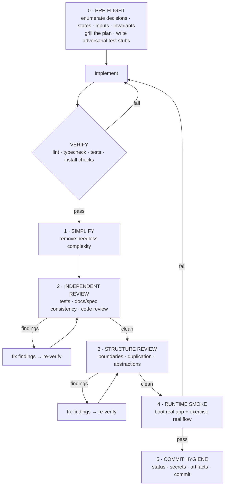

# Completion Gate — definition of done

A unit of work is **not done** until this flow has run to green. Treat it as the
definition of done, not optional polish. Each layer catches the cheapest class of
failure it can: mechanical checks first, then simplification, independent review,
structure review, runtime verification, and commit hygiene.

This gate fires at the end of **every phase**, not once at the end of the whole
effort. The framing pass (plan + grill + design the system) happens up front in
`SKILL.md`; each phase then runs Pre-flight → Implement → this gate → commit.

Read this at the moment of use, not from memory. Follow every step in order,
including the loops. Do not self-certify — the author shares their own blind spots,
which is exactly what the independent layers exist to catch.

Each stage names the tool that powers it and the manual fallback when that tool
isn't installed (see `setup.md` to install them). Use the project's actual
commands — replace examples like `pnpm test`, `/codex:review`, or
`/structural-code-review` with the local equivalents.



## VERIFY

> **Tool:** `/verify` (native) for runtime confirmation · project's own lint/typecheck/test commands. **Fallback:** run the commands directly.

Run mechanical checks after every meaningful change:

```bash
pnpm lint
pnpm typecheck
pnpm test
```

Add the equivalent checks for the stack: formatter, typecheck/compile, unit and
integration tests, coverage thresholds for risky pure logic, dependency/install
checks, generated-code checks. **Do not move deeper while mechanical checks are red.**

## 0 · PRE-FLIGHT

> **Tool:** `grill-with-docs` to pressure-test the plan against project docs/decisions. **Fallback:** grill manually against the docs, schemas, and ADRs you have.

Before implementation, enumerate the problem space — this prevents review rounds
from discovering missing cases one at a time. Pick the artifacts that fit:

- **Decision table** — classification, branching, permission, routing, handling
  logic. List input axes and expected outcome for every meaningful combination.
- **State-machine table** — lifecycles, jobs, queues, workflows, external calls,
  retries, crash recovery. List states, meanings, transitions, invalid transitions.
- **Field / input inventory** — forms, API payloads, provider calls, DB writes,
  exports, imports, generated files. List every field, source, validation rule,
  sink, and failure behavior.
- **Invariant list** — constraints from the plan, docs, product requirements,
  ADRs, schemas, and existing behavior.
- **Adversarial test stubs** — failing tests / checklist items for empty,
  malformed, duplicate, boundary, authorization, tenancy, idempotency, concurrency,
  and partial-failure cases.

If a surface is multi-axis, split enumeration across multiple reviewers/agents
before coding, then merge their findings into one implementation checklist.

## 1 · SIMPLIFY

> **Tool:** `/simplify` (native). **Fallback:** manual review for the items below.

Run the simplification pass, then re-run VERIFY. Look for:

- unnecessary abstractions
- duplicated logic
- slow or wasteful work
- hard-to-read branching
- unused code and dead paths
- easier ways to express the same behavior

## 2 · INDEPENDENT REVIEW

> **Tool:** `/codex:review` (Codex plugin) — a review from a different model. **Fallback:** any independent reviewer (another agent, model, or person).

Get at least one independent pass before declaring complete. Use what's available:

- an adversarial test author or reviewer
- a docs/spec consistency review
- a code review from another agent/model/person
- a security or data-boundary review for sensitive surfaces
- a product behavior review for user-facing flows

Fix every accepted finding, re-run VERIFY, and repeat until clean or remaining
findings are explicitly deferred. If review loops keep surfacing the same class of
issue, stop patching one instance at a time — audit the whole class and fix it in
one pass.

## 3 · STRUCTURE REVIEW

> **Tool:** `/structural-code-review`. **Fallback:** manual structural pass on the checks below.

Run a structural maintainability pass, then re-run VERIFY. Check:

- boundaries and ownership
- duplicated operational logic
- large files, large functions, overgrown components
- abstractions that do not pay for themselves
- domain rules leaking into generic helpers
- services/helpers reaching into state they should not own
- branching that should be replaced by a clearer model

Refactor only when it materially improves maintainability.

## 4 · RUNTIME SMOKE

> **Tool:** `frontend-visual-qa` for UI (desktop + mobile screenshots, state coverage, keyboard paths) · `/verify` to boot and exercise. **Fallback:** boot the app and drive the flows by hand.

Tests are not enough. Boot the actual app/service in the closest practical local
environment and exercise:

- the main happy path
- at least one realistic failure path
- malformed or missing inputs
- invalid or missing auth when relevant
- duplicate or boundary values
- any external integration, DB write, queue, file, or generated artifact touched

For frontend work, include real-browser checks at desktop and mobile widths. For
backend work, include real requests/commands against a running service when
possible. Record any skipped smoke checks and why.

## 5 · COMMIT HYGIENE

> **Tool:** git. **Fallback:** none — always do this.

Before committing:

- review `git status`
- inspect the diff
- exclude generated artifacts that should not be committed
- check for secrets, tokens, env files, private data, and local-only paths
- ensure docs, tests, migrations, and generated types are included when needed
- commit only after the gate passes or explicit deferrals are recorded
